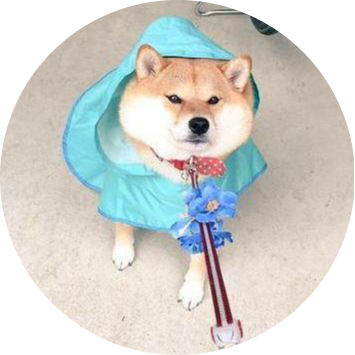

<h1 align="center"> NLP Course | 专属定制</h1>

  	
  
  
   	
  	
    
     

  <a href="#项目动机">项目动机</a>/
  <a href="#组织者列表">组织者列表</a>/
  <a href="#贡献者列表">贡献者列表</a>

## 项目动机

自然语言处理（NLP）被誉为人工智能皇冠上的明珠👑，在近些年取得了长足的进步，其中一些成果，例如ChatGPT，也成功火爆出圈，获得了各界人士的关注，这都依赖于多种NLP技术的蓬勃发展与强力加持。
在这一背景下，不论是初学者，亦或是高级研究者，均迫切的希望学习、巩固、提升自己的NLP知识。
在各种学习资料“百花齐放”的时代， [Lena Voita](https://lena-voita.github.io/) 博士的 [NLP Course | For You](https://lena-voita.github.io/nlp_course.html) 更是吸引了众多人的眼球，其精美的动图极大的降低了NLP各个知识点的学习难度。
因此，MLNLP社区在 [Lena Voita](https://lena-voita.github.io/) 博士的支持下，集合<a href="#贡献者列表">多位志愿者</a>的力量将其翻译为中文版本，以供国内同学学习，
希望能对大家有所帮助。

<h3 align="center"><b><a href="https://mlnlp-world.github.io/NLP-Course-Chinese/" target="_blank">☞ NLP Course | 专属定制</a></b></h3>

### 欢迎贡献
由于我们的水平有限，如有疏漏，还望谅解，欢迎任何的PR及issue讨论。

## 致谢 Lena Voita 博士

感谢 [Lena Voita](https://lena-voita.github.io/) 博士完成如此惊艳生动、精妙绝伦的在线课程，为一众NLP初学者提供了极其宝贵的学习资源，借用《上帝掷骰子吗？：量子物理史话》一书序言， **“这个故事更像一个传奇，由一个不起眼的线索开始，曲径通幽，渐渐地落英缤纷，乱花迷眼。正在没头绪处时，突然间峰回路转，天地开阔，如河出伏流，一泻汪洋，但还未来得及一览美景，转眼间却又大起大落，误入白云深处不知归路”**。感谢 [Lena Voita](https://lena-voita.github.io/) 博士的慷慨授权，使得MLNLP社区有机会将其译为中文，以供国内NLP初学者学习。

## 组织者列表

感谢以下同学对本项目进行组织与指导（排名不分先后）

 
 
 
 
 
 
 
 
 
 

## 贡献者列表

感谢以下同学对本项目的支持与贡献（排名不分先后）

 
 
 
 
 
 
 
 
 
 